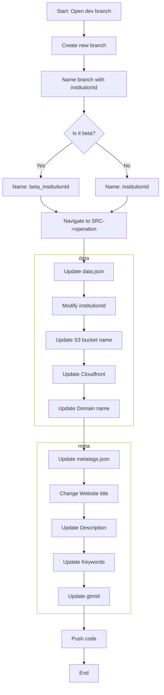

# Dance Studio Repository
This repository contains the codebase for Dance Studio, a dynamic institution-based deployment system.

## Repository Structure
```
src/
├── Development/     # All development work goes here
└── Operation/      # Operational configurations and data
    ├── data.json         # Institution-specific data
    └── metatags.json     # Meta tags configuration
```

### Development Directory
All new feature development, bug fixes, and improvements should be implemented in the Development directory. This separation ensures clean organization between operational configurations and actual development work.

### Operation Directory
The Operation directory contains configuration files that control deployment and institution-specific settings:
- `data.json`: Contains institution-specific data including:
  - `institutionId`: Unique identifier (e.g., "dance123")
  - `cloudFrontId`: AWS CloudFront distribution ID
  - Other institution-specific configurations
- `metatags.json`: Contains metadata configurations for the application

## Release Code Generation Process
The following diagram illustrates the step-by-step process for generating release code:



## Deployment Workflow
The repository uses GitHub Actions for automated deployments to AWS S3 and CloudFront. The workflow is triggered on every push to any branch.

### Workflow Details
1. **Branch Detection**:
   - Production branches: `institutionName` (e.g., "dance")
   - Development branches: `beta-institutionName` (e.g., "beta-dance")
2. **Environment Configuration**:
   - Production branches deploy with `REACT_APP_STAGE=PROD`
   - Beta branches deploy with `REACT_APP_STAGE=DEV`
3. **Deployment Process**:
   - Checks out the code
   - Sets up Node.js environment
   - Installs dependencies
   - Reads configuration from Operation/data.json
   - Determines deployment settings based on branch name
   - Updates environment variables
   - Builds the React application
   - Deploys to AWS S3
   - Invalidates CloudFront cache

### Deployment Destinations
- **Production Branches**:
  - S3 Bucket: `institutionName.com`
  - Example: `dance.com`
- **Beta Branches**:
  - S3 Bucket: `beta.institutionName.com`
  - Example: `beta.dance.com`

### Automatic Deployment Rules
The workflow automatically determines whether to deploy based on the branch name:
- If the branch name matches either `institutionName` or `beta-institutionName`, deployment proceeds
- For other branch names, the deployment is skipped

## Development Guidelines
1. **New Features**:
   - All new development work should be done in the Development directory
   - Create feature branches from the appropriate base branch
2. **Operational Changes**:
   - Updates to institution configurations should be made in the Operation directory
   - Always validate JSON files before committing
3. **Branch Naming**:
   - Production: Use the institution name (e.g., "dance")
   - Development: Prefix with "beta-" (e.g., "beta-dance")

## Security Note
- Ensure all sensitive credentials are stored as GitHub Secrets
- Never commit AWS credentials directly in the workflow file
- Regularly rotate access keys and update GitHub Secrets accordingly

## Troubleshooting
If deployment fails:
1. Check the GitHub Actions logs
2. Verify the institution ID format in data.json
3. Ensure AWS credentials are properly configured
4. Validate the S3 bucket names and permissions
5. Check CloudFront distribution ID correctness
