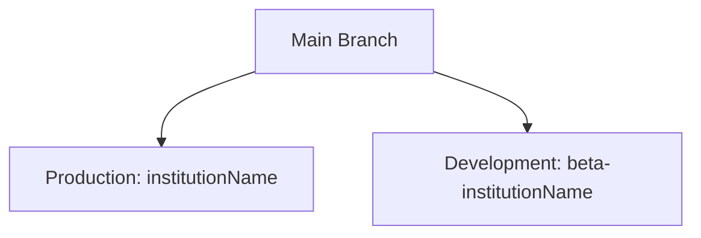

# Dance Studio Repository


> An elegant solution for dynamic institution-based deployments, powered by AWS and React.

---

## 📁 Repository Structure

The repository follows a clear separation of concerns with two main directories:

```bash
src/
├── Development/     # 💻 Development workspace 
└── Operation/      # ⚙️ Operational configs
    ├── data.json         # Institution data
    └── metatags.json     # Meta configurations
```

### 🔨 Development Directory (`src/Development/`)

This is where all development work including:
- New features
- Bug fixes
- Components
- UI improvements
- Business logic

### ⚙️ Operation Directory (`src/Operation/`)

Houses critical configuration files:

#### `data.json`
```json
{
    "institutionId": "happyprancer1234",          # The institutionId needs to be replaced here

    "s3BucketName": "beta.happyprancer.com",      # The bucket name where the frontend of the institution is deployed

    "cloudFrontId": "E263LXOGXF3H0N",             # The cloudfrontId attached with the particular institution

    "domain": "https://beta.happyprancer.com"
}
```

#### `metatags.json`
```json
{
  // Meta configurations for SEO and display
}
```

---

## 🚀 Deployment Workflow

Our sophisticated deployment pipeline automatically handles everything from build to delivery.

### 🌳 Branch Strategy



| Branch Type | Pattern | Example | Environment |
|------------|---------|---------|-------------|
| Production | `institutionName` | `dance` | `PROD` |
| Development | `beta-institutionName` | `beta-dance` | `DEV` |

### 📦 Deployment Process

1. **🔍 Branch Detection**
   ```bash
   # Production branch
   dance → dance.com
   
   # Development branch
   beta-dance → beta.dance.com
   ```

2. **🛠️ Build Configuration**
   - Production: `REACT_APP_STAGE=PROD`
   - Development: `REACT_APP_STAGE=DEV`

3. **📤 Deployment Steps**
   ```mermaid
   graph LR
       A[Code Checkout] --> B[Setup Node.js]
       B --> C[Install Dependencies]
       C --> D[Read Configs]
       D --> E[Build React App]
       E --> F[Deploy to S3]
       F --> G[Invalidate CloudFront]
   ```

---

## 👩‍💻 Development Guidelines

### Starting New Development

1. Create a new branch from appropriate base
   ```bash
   # For new feature in development
   git checkout -b beta-dance/new-feature
   
   # For production fixes
   git checkout -b dance/hotfix
   ```

2. Work within the Development directory
   ```bash
   cd src/Development/
   ```

3. Test thoroughly before pushing
   ```bash
   yarn test
   yarn build
   ```

### Making Operational Changes

1. Navigate to Operation directory
   ```bash
   cd src/Operation/
   ```

2. Validate JSON before committing
   ```bash
   yarn validate-json
   ```

---

## 🔒 Security Best Practices

- ✅ Use GitHub Secrets for credentials
- ❌ Never commit AWS keys
- 🔄 Rotate access keys regularly
- 🛡️ Maintain least-privilege access

---

## ❗ Troubleshooting

If deployment fails, follow these steps:

1. **Check GitHub Actions Logs**
   ```bash
   # Look for specific error messages in the workflow run
   ```

2. **Verify Institution ID**
   ```json
   // Operation/data.json
   {
     "institutionId": "dance123" // Should match expected format
   }
   ```

3. **Validate AWS Configuration**
   - S3 bucket exists and is accessible
   - CloudFront distribution ID is correct
   - IAM permissions are properly set

---

## 🆘 Need Help?

- 📝 Open an issue for bugs
- 💡 Create a discussion for feature requests
- 📧 Contact the DevOps team for deployment issues

---

## 📄 License

This project is proprietary and confidential.

---

*Made with ❤️ by the Dance Studio Team*
