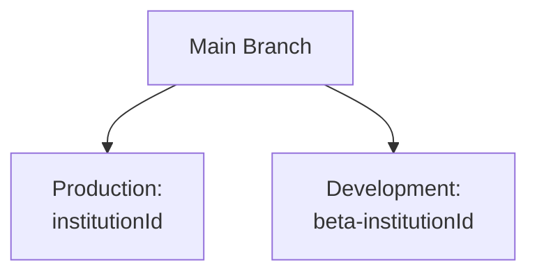

# Dance Studio Repository


> An elegant solution for dynamic institution-based deployments, powered by AWS and React.

---

## 📁 Repository Structure

The repository follows a clear separation of concerns with two main directories:

```bash
src/
├── Development/     # 💻 Development workspace 
└── Operation/      # ⚙️ Operational configs
    ├── data.json         # Institution data
    └── metatags.json     # Meta configurations
```

### 🔨 Development Directory (`src/Development/`)

This is where all development work including:
- New features
- Bug fixes
- Components
- UI improvements
- Business logic

### ⚙️ Operation Directory (`src/Operation/`)

Houses critical configuration files:

#### `data.json`
```json
{
    "institutionId": "happyprancer1234",          # The institutionId needs to be replaced here

    "s3BucketName": "beta.happyprancer.com",      # The bucket name where the frontend of the institution is deployed

    "cloudFrontId": "E263LXOGXF3H0N",             # The cloudfrontId attached with the particular institution

    "domain": "https://beta.happyprancer.com"     # The domain name where the institution is hosted
}
```

#### `metatags.json`
```json
{
    "title": "Welcome to Happyprancer: Dance Your Way to Fun and Fitness!",     # Change the title here 

    "description": "Discover fun fitness at Happyprancer! Join our Zumba, Bollywood, and yoga classes online. Sign up today and let's dance, sweat, and celebrate your health!",   # Change the description here

    "keywords": [                                                              # Add some keywords here
        "happyprancer",
        "dance fitness online",
        "zumba classes",
        "bollywood dance fitness"
    ],
    "gtmId": "GTM-5DW548R"                                                    # Change the GTMID here
}
```

---

## 🚀 Deployment Workflow

Our sophisticated deployment pipeline automatically handles everything from build to delivery.

### 🌳 Branch Strategy



| Branch Type | Pattern | Example | Environment |
|------------|---------|---------|-------------|
| Production | `institutionId` | `dance` | `PROD` |
| Development | `beta-institutionId` |`beta-dance` | `DEV` |

# Operations Team Configuration Guide

Welcome to the Operations Configuration Guide! This document provides step-by-step instructions for making configuration changes through the GitHub web interface.

## 📋 Overview

As a member of the operations team, you'll be responsible for updating the following configuration files:
- `src/Operation/data.json`
- `src/Operation/metatags.json`

## 🚀 Making Configuration Changes in GitHub


### Step 1: Create a New Branch

1. Navigate to the repository on GitHub
2. Click on the branch dropdown (typically showing "dev")
3. Enter a new branch name following the format: `institutionId`
4. Select "Create branch: named as 'institutionId' from 'dev'"

### Step 2: Navigate to Configuration Files

1. Navigate to the `src` folder
2. Enter the `Operation` folder
3. Locate the configuration files:
   - `data.json`
   - `metatags.json`

### Step 3: Edit JSON Files

1. Select the file you wish to edit (e.g., `data.json`)
2. Click the pencil icon (Edit file) in the top right corner
3. Make your desired changes
4. Verify JSON validity:
   - Watch for red squiggly lines indicating errors
   - Address any validation issues before proceeding

### Step 4: Commit Your Changes

1. Scroll to the bottom of the page
2. Provide a descriptive commit message:
   ```
   Update configuration: [Brief description]
   - Changed X in data.json
   - Updated Y in metatags.json
   ```
3. Ensure "Commit directly to the ops/config-update branch" is selected
4. Click "Commit changes"

## ⚠️ Important Notes

1. **Only** modify files in `src/Operation/`
2. **Always** create branches from `dev`
3. **Check** for JSON validation errors before committing
4. **Never** commit directly to the development branch

## 🆘 Need Help?

- For technical issues: Contact the development team
- For access issues: Contact your team lead
- For GitHub navigation: Check GitHub's documentation

## 🔄 Quick Reference

1. Create branch from development
2. Navigate to Operation folder
3. Edit JSON files
4. Commit changes

Remember: The GitHub interface will help validate your JSON. If you see red squiggly lines, fix those errors before committing!

## 🔒 Security Best Practices

- ✅ Use GitHub Secrets for credentials
- ❌ Never commit AWS keys
- 🔄 Rotate access keys regularly
- 🛡️ Maintain least-privilege access

---

## ❗ Troubleshooting

If deployment fails, follow these steps:

1. **Check GitHub Actions Logs**
   ```bash
   # Look for specific error messages in the workflow run
   ```

2. **Verify Institution ID**
   ```json
   // Operation/data.json
   // Should match expected format
   {
     "institutionId": "dance123"
   
    "s3BucketName": "beta.happyprancer.com",

    "cloudFrontId": "E263LXOGXF3H0N",

    "domain": "https://beta.happyprancer.com"
   }
   ```

3. **Validate AWS Configuration**
   - S3 bucket exists and is accessible
   - CloudFront distribution ID is correct
   - IAM permissions are properly set

---

## 🆘 Need Help?

- 📝 Open an issue for bugs
- 💡 Create a discussion for feature requests
- 📧 Contact the DevOps team for deployment issues

---

## 📄 License

This project is proprietary and confidential.

---

*Made with ❤️ by the Dance Studio Team*
